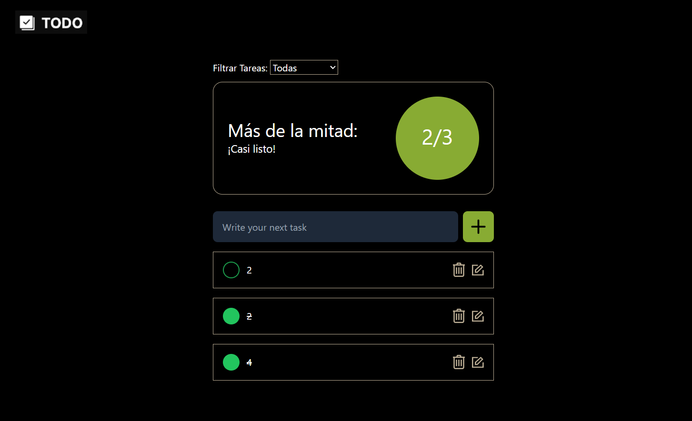
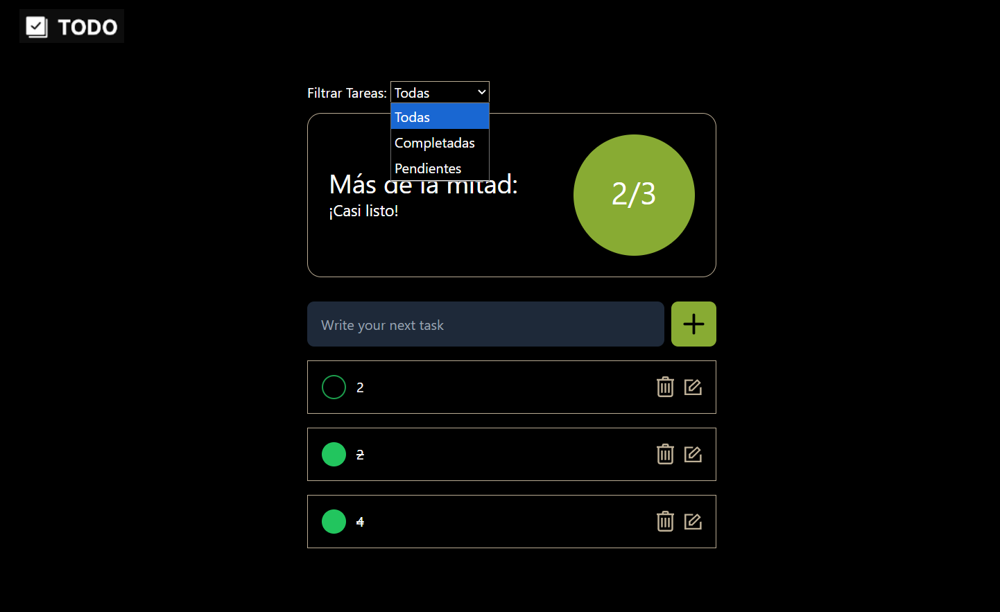
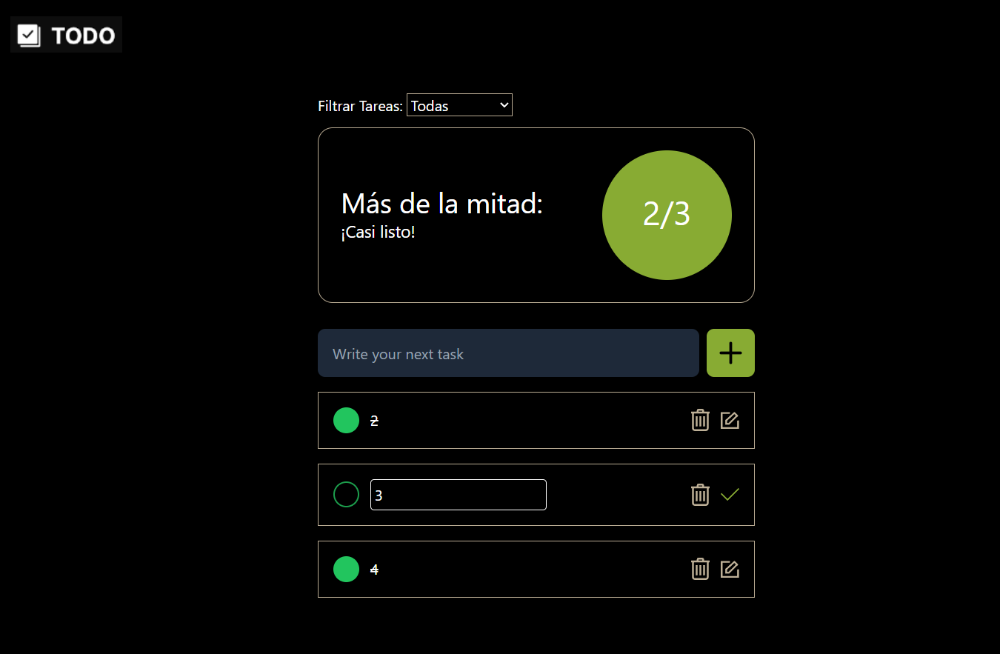
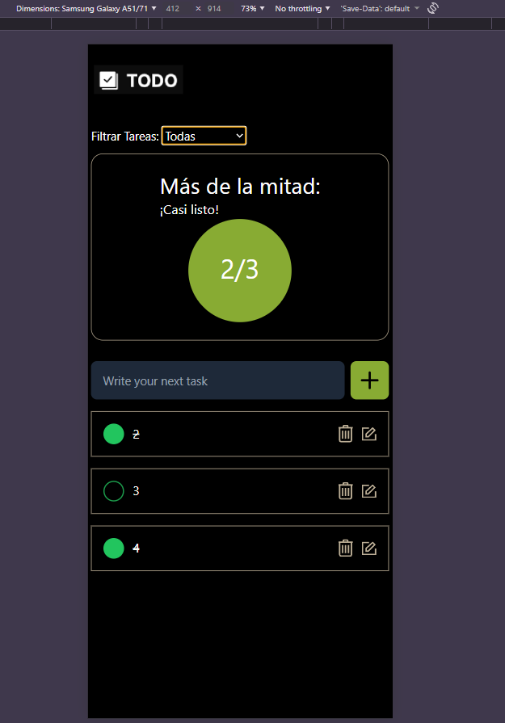

# Todo List

**Todo List** 
Es una aplicación web que permite administrar tareas, permite  agregar, editar, eliminar y marcar tareas como completadas, además de visualizar el progreso general mediante una barra de progreso.  
Todas las tareas se almacenan en el Local Storage del navegador para mantener persistencia de los datos incluso al recargar la página.

## Descripción:
la aplicacion permite :
- Crear nuevas tareas.  
- Editar tareas existentes.  
- Eliminar tareas localmente.  
- Marcar tareas como completadas.  
- Guardar y cargar tareas desde el Local Storage.  
- Visualizar el progreso con una barra de progreso dinámica.

## Tecnologías utilizadas:
- React
- Tailwind CSS

## Arquitectura y decisiones importantes
El proyecto sigue una **arquitectura basada en componentes**, lo que permite dividir la aplicación en partes pequeñas, reutilizables y fáciles de mantener.  
Las carpetas están organizadas **según su tipo**, es decir, agrupadas por el propósito que cumplen dentro del proyecto.  

La carpeta `components` contiene todos los componentes visuales de la aplicación como, la lista de tareas, el formulario para crear nuevas tareas, la barra de progreso, el botón desplegable, el encabezado y las tarjetas que muestran cada tarea.  
En la carpeta `hooks` se ubican los **hooks personalizados**, entre ellos `useTasks`, que gestiona el estado global de las tareas (creación, edición, eliminación y marcado como completadas), y `useFilter`, que se encarga de filtrar las tareas visibles en pantalla.  
por último, la carpeta `utils` contiene las **funciones auxiliares** que se encargan de leer y escribir los datos en el Local Storage, asegurando que las tareas se mantengan persistentes.

## Print de pantallas y demostración

### Demostración en video

### Visualización en computadora

### Visualización en teléfono móvil

## Instrucciones para correr el proyecto localmente

1. **Clonar el repositorio**
En tu terminal (Bash, PowerShell, CMD o cualquier otra) ejecutar:
git clone https://github.com/EdwinNoe/ToDo-List-.git

2. **Entrar al directorio del proyecto**
cd ToDo-List-

3. **Instalar dependencias** 
npm install

3. **Levantar el servidor de desarrollo** 
npm run dev

4. **Abrir la aplicación en el navegador**
Copiar y pegar la URL que aparece en consola ,por defecto suele ser http://localhost:5173